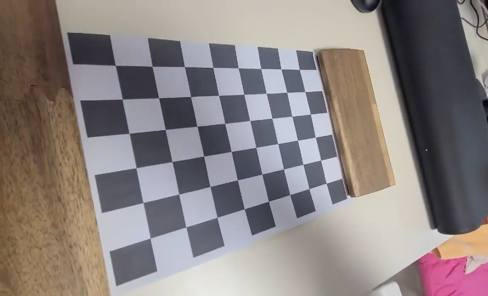
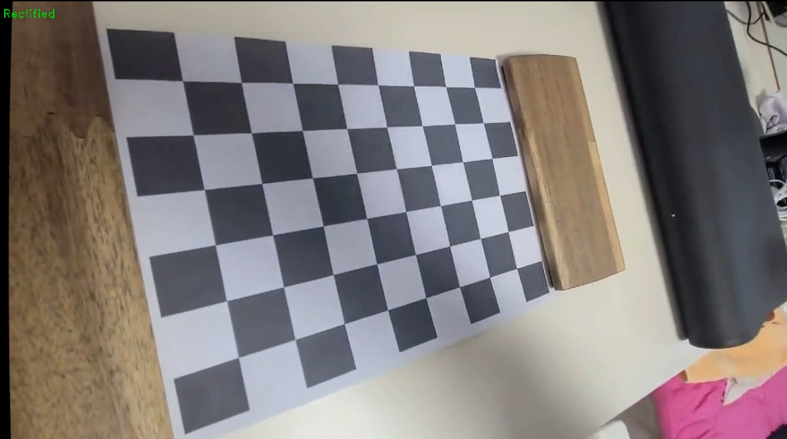

# Super Calibrator
카메라의 왜곡을 보정하여 실사와 비슷하게 보정해 줍니다.  
calibration.py 를 이용하여 카메라 행렬과 왜곡 계수를 구할 수 있습니다.  
distortion.py 를 이용하여 영상에 왜곡 보정을 적용할 수 있습니다.  
data/output.avi 로 실행 결과가 Video로 저장됩니다.

## Camera Calibration Results
* The number of selected images = 5
* RMS error = 0.5958336974506659
* Camera matrix (K) =  
[[607.21421351   0.         631.61705825]  
 [  0.         611.4314851  376.7056395 ]  
 [  0.           0.           1.        ]]  
* fx, fy = [607.21421351, 611.4314851]  
cx, cy = [631.61705825, 376.7056395]  
s = 0.
* Distortion coefficient (k1, k2, p1, p2, k3, ...) =  
[ 0.01249517 -0.00812537 -0.00134196 -0.00195656  0.00709386]

## Original ScreenShot

## Rectified ScreenShot

## Video
data 폴더 안에 Original과 Rectified Video가 있습니다.